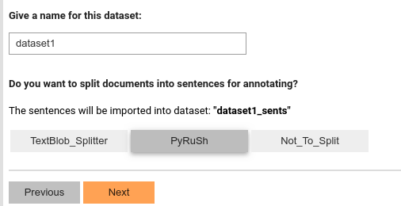
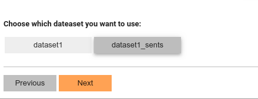

# Setup Dataset
## Import Data
Once we finish the essential configuration of SmartAnno, we will be asked to import data--usually txt files.

Follow the file navigator to locate the directory where the input documents are stored, and click "Confirm".

Also, we can specify how many documents you want to import (instead of importing all of them in that directory).

___

___
## Name your dataset
After importing, we can give a name for this imported dataset (document-level)

The SmartAnno will also ask if we want to split sentences to create a sentence-level dataset. We have two options:
using [TextBlob sentence splitter](https://textblob.readthedocs.io/en/dev/) or [PyRuSh](https://github.com/jianlins/pyrush).
 The PyRuSH is a sentence segmenter customized for clinical text.    

## Select an dataset

If you chose the sentence splitting above, you will see two datasets:

* Document-level dataset: you will review and annotate per document.
* Sentence-level dataset(with a surfix '_sents'): you will review and annotate per sentence.

 
