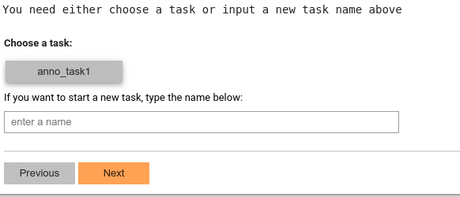
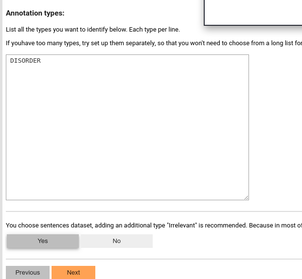

# Setup Annotation Task
## Name the task
Once the dataset is selected, we can create a annotation task: get some samples from a dataset, set up annotation schema,
generate pre-annotations, and reserve the space for manual annotations.

Then we can give a name for this annotation task, so that we can come back to this task later:

## Setup annotation schema
Currently, SmartAnno only support defining annotation types. If you need attributes, you can work around it by flatten 
the attributes and values. Each line will be considered as an annotation type. In the following example, we define a 
type named "DISORDER." 

SmartAnno will also recommend to define a "Irrelevant" type by default, so that we can have some negative samples. If 
you are sure, all the samples are relevant (must be classified into one of the types listed in the textarea), you can 
choose "No."

