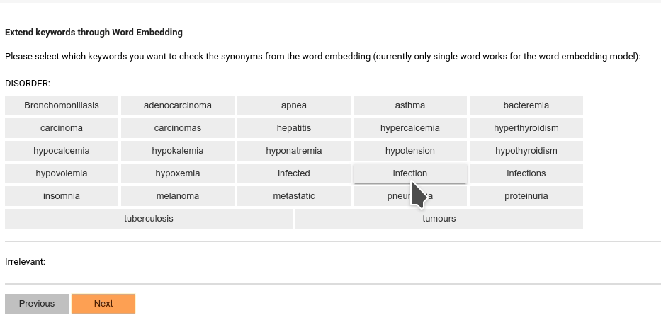

# Setup Pre-annotator

The pre-annotator is an agent running in the background to make a best guest of un-reviewed data 
before human annotators start to annotate the samples. A good preannotator can potentially [speed 
up annotation process](https://pubmed.ncbi.nlm.nih.gov/24001514/) and [improve annotation quality] (https://arxiv.org/pdf/1808.03806).

SmartAnno uses adaptive models in the backend to complete the pre-annotations: 
* At the beginning of the annotation, it will use rule-base pre-annotator (built on top of the ConText algorithm),
which can efficiently rule out negated samples.
* After annotators complete some annotations, it will switch to using a machine learning based model to complete the 
pre-annotations. This machine learning based model can be replaced or customized, as long as it follows the [required 
interface](https://github.com/jianlins/SmartAnno/blob/master/SmartAnno/models/BaseClassifier.py)

## Configure rule-based pre-annotator
At the beginning, you will need to configure this rule-based pre-annotator by adding keywords to each annotation type.

### The UMLS-based synonym expander
If you have [configured UMLS API key](1_config_smartanno.html#configure-umls-api-key), you are now able to use UMLS 
provided REST service to expand your keywords.

First, you can select with keywords you want to discover using embedding:

Then you will be prompt to choose which candidates are the synonyms to the selected keywords:

### The Word-embedding-based related term expander
If you have [configured the word embedding model](1_config_smartanno.html#configure-word-embedding-model), you are now 
able to use the embedding model to expand your keywords.

First, you can select with keywords you want to discover using embedding:

Then you will be prompt to choose which candidates are relevant to the selected keywords:

SmartAnno will automatically merge the duplicated keywords. All these keywords will be used to pre-annotate the incoming 
samples. 

## Machine-learning-based pre-annotator
The machine-learning-based pre-annotator will be configured later..