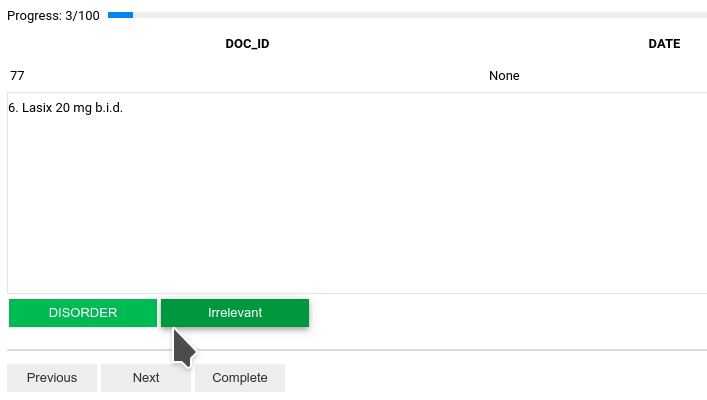

# Annotate
After all the setup steps, now we can start to annotate samples. Depends on which type of dataset we chose, we could 
review/annotate either documents or sentences. Simply click the button of the correct anotation type.

___

___

**Note:** SmartAnno is still under development, throwing some errors during annotating are expected. However, you can 
always restart the program to continue annotating.