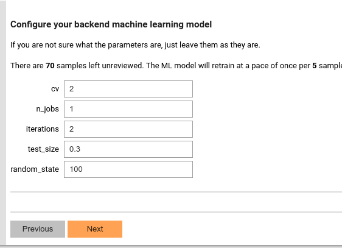

# Configure Machine-learning-based Pre-annotator
Once some samples have been annotated (the amount can be (configured by "rb_model_threshold")[https://github.com/jianlins/SmartAnno/blob/master/conf/smartanno_conf.json]),
the machine-learning-based pre-annotator will be kicked out to run. Before that, you will be asked to set some parameters. 

These parameters are dynamically read from the ML class field, e.g. (LogisticBOWClassifier)[https://github.com/jianlins/SmartAnno/blob/master/SmartAnno/models/logistic/LogisticBOWClassifier.py]. 
So that when we configure to use a different ML model, we don't need to reprogram the GUI.

