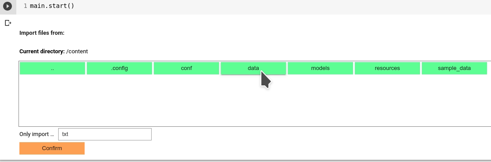

# Import Data
Once you finish the essential configuration of SmartAnno, you will be asked to import data--usually txt files.
Follow the file navigator to locate the directory where the input documents are stored, and click import.

