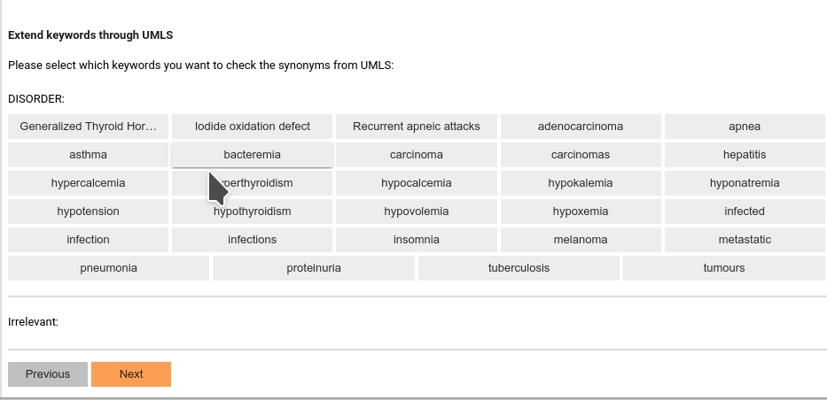

# SmartAnno

SmartAnno is a semi-automatic annotation tool implemented within jupyter notebook. 
It uses deep learning model in the backend to learn a smarter and smarter model over time while users annotating the data. 
It also integrates word embedding, and UMLS synonym heuristics to improve learning rate.


## Installation

```bash
pip install smartanno
```

if you have older version installed, then you might want to try upgrade it:

```bash
pip install smartanno -U --no-cache-dir
```

## How to use

Within a jupyter notebook, add a python cell, type: 
```python
from SmartAnno.gui.Main import Main
main=Main()
```
Then, create another python cell, type:
```python
main.start()
```

## A glimp of features

### UMLS-based synonym expander


### Word-embedding-based related term expander


### Notebook embedded snippet annotation interface


## A Colab Notebook Demo: 

https://colab.research.google.com/drive/1hKauV26CTreyzwsa-2eipLmSJxQo2SmB?usp=sharing