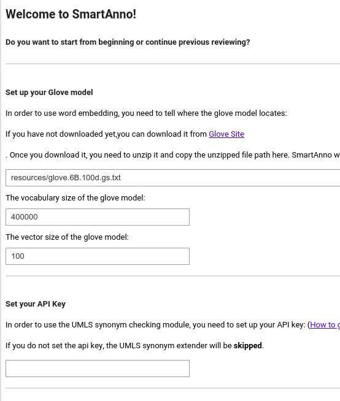

# Configure SmartAnno
Because current SmartAnno's backend models use word embedding, we need to configure where to get the pretrained 
embedding model, and its vocabulary size and dimension size.

If you are directly download Glove embedding, you will need to use gensim to convert the format first as below
```python
from gensim.scripts.glove2word2vec import glove2word2vec
# suppose 'resources/glove.6B.100d.txt' is the embedding file to be converted 
glove2word2vec('resources/glove.6B.100d.txt', 'resources/glove.6B.100d.gs.txt')
```

Then you can check the its vocabulary and dimension size using following command (linux): 
```bash
head -1 resources/glove.6B.100d.gs.txt
```
The first number is the vocabulary size, the 2nd is the dimension size.

With the information above, we are now able to configure SmartAnno:


