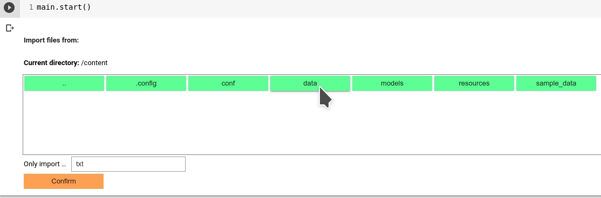

# Import Data
Once you finish the essential configuration of SmartAnno, you will be asked to import data--usually txt files.

Follow the file navigator to locate the directory where the input documents are stored, and click "Confirm".

Also, you can specify how many documents you want to import (instead of importing all of them in that directory).

___

